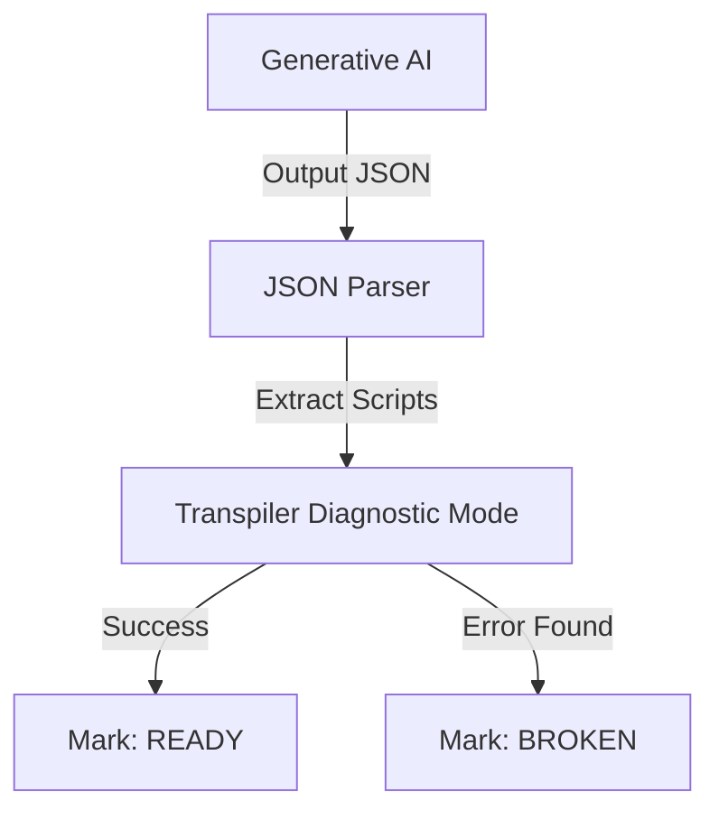

# THE CRUCIBLE: SCRIPT VALIDATION PROTOCOL (v2.0)

> **Role:** The Gatekeeper.
> **Function:** Detects errors. If errors are found, it blocks the game and summons the Architect (User).

## 1. THE VALIDATION PIPELINE

The "Crucible" runs immediately after any Generation Phase that produces code.

## 2. ERROR TAXONOMY

The Transpiler categorizes errors for the User to see.

| Error Code | Type | Trigger Example | Feedback Message |
| :--- | :--- | :--- | :--- |
| **ERR_HALLUCINATION** | invalid_api | `CastFireball(Target)` | "Function 'CastFireball' does not exist. Use API only." |
| **ERR_SYNTAX** | parse_error | `if x > 10 then` (JS mode) | "Syntax Error: Missing braces or invalid syntax." |
| **ERR_SCOPE** | unknown_var | `let x = 10` | "Variable 'x' violates scope rules. Use unique prefix." |
| **ERR_TYPE** | type_mismatch | `Push(Target, "Far")` | "Argument 2 of 'Push' expects Integer, found String." |

## 3. THE HANDOFF (Human-in-the-Loop)

We do not trust the AI to fix itself efficiently. We trust the User.

### 3.1 The Broken State
If a script fails validation:
1.  The Entity (e.g., "Goblin Shaman") is flagged `BROKEN`.
2.  The World Generation halts at the "Review" phase.
3.  The **PLAY** button is disabled.

### 3.2 The Repair Interface
The User enters **Architect View**:
1.  A list of "Compilation Errors" is shown.
2.  Clicking an error opens the **Aether IDE**.
3.  The AI's broken code is displayed with the Error Line highlighted.
4.  User edits the code -> Clicks [COMPILE].
5.  If Success: Entity flag clears to `READY`.
6.  When all entities are `READY`, the **PLAY** button enables.

---

## 4. STATIC ANALYSIS RULES (The Linter)

1.  **The Whitelist Check:** Scan for function calls. If not in `API_WHITELIST`, error.
2.  **The Scoping Check:**
    *   The Generator provides a `ContextPrefix` (e.g., `fireball_`).
    *   The Linter checks that ALL declared variables start with `fireball_`.
    *   *Reasoning:* Prevents collisions in Wasm global memory.
